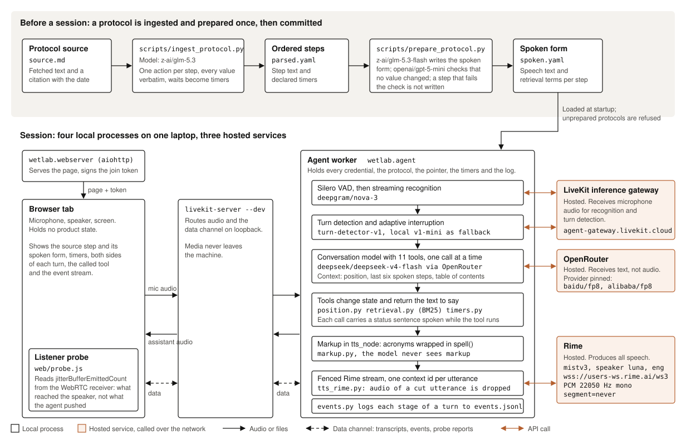

# Wetlab Assistant

Wet-lab experiments are run by following a written protocol. A protocol often
has dozens of steps, each with exact amounts, temperatures and times, and the
steps must be done in order. A wrong step usually cannot be undone, and the
mistake often shows only when the experiment fails. While working, the
researcher's hands are gloved and busy, and the protocol is on a page or screen
they cannot easily reach. To check it, they must stop, find their place again,
and carry a value back in their head.

Wetlab Assistant reads the protocol aloud, keeps track of the current step, and
answers questions about the protocol by voice while the researcher works. We
built it for the DataForge x Rime hackathon, and all of its speech comes from
Rime.

## Contents

- [Executive summary](#executive-summary)
- [Demo](#demo)
- [The larger system](#the-larger-system)
- [How it works](#how-it-works)
  - [Preparing a protocol](#preparing-a-protocol)
  - [The live session](#the-live-session)
  - [Rime settings](#rime-settings)
  - [Data that leaves the machine](#data-that-leaves-the-machine)
- [Results](#results)
  - [Pronunciation](#pronunciation)
  - [Response time](#response-time)
  - [Status messages](#status-messages)
  - [Interruptions](#interruptions)
- [Setup](#setup)
  - [Adding a protocol](#adding-a-protocol)
  - [Tests and measurements](#tests-and-measurements)
- [When something fails](#when-something-fails)
- [Limitations](#limitations)
- [Repository layout](#repository-layout)

## Executive summary

This is the protocol-reading part of a voice-only lab assistant we are
building. It reads a written protocol aloud one step at a time, answers
questions about it, finds earlier steps on request, runs timers, and can be
interrupted at any point without losing its place. It runs on LiveKit Agents
with streaming speech recognition, an LLM that moves through the protocol by
calling tools, and Rime `mistv3` for all speech. Lab protocols are full of
units, reagent names and acronyms that a speech engine reads wrongly when it
gets the text as written, so every protocol is rewritten offline into a spoken
form and checked by a second model before use. In a test over two published
protocols, the rewritten text raised the share of numbers, units and reagent
names heard correctly from 87% to 98%.

## Demo

[`assets/demo.mp4`](assets/demo.mp4) (8 min 47 s) is a full session on the NEB
Q5 PCR protocol. It includes a question asked mid-protocol, an interruption,
a look-up of an earlier step, and the original and rewritten versions of the
same step played one after the other.

## The larger system

The protocol reader is the first part of a lab assistant that is used only by
voice. Two more parts are planned. Neither is built yet.

- Observation logging. You say what you see at the bench, and it is stored as
  a structured record with the step, the sample, the value and the time. You
  can then search the records or ask about them by voice.
- Lab notes. You record notes, method changes and decisions by voice, and find
  them again later by asking.

All three parts would run as tools under one agent. Much of what is built here
carries over: the voice loop and its interruption handling, the BM25 search
behind `look_up`, the event log, and the spoken-form rewriting, which every
value the assistant reads back to you will need.

## How it works



The system has two parts. An offline pass prepares each protocol, and a live
session reads it.

### Preparing a protocol

A protocol starts as its source text in `data/corpus/<id>/source.md`, with a
citation. `scripts/ingest_protocol.py` uses `z-ai/glm-5.3` to split the text
into ordered steps, turns waiting times into timers, and writes `parsed.yaml`.
Every number in the output has to appear in the source.

`scripts/prepare_protocol.py` then writes `spoken.yaml`. For each step it holds
the text that Rime will read and a few search terms. `z-ai/glm-5.3-flash`
writes it and `openai/gpt-5-mini` compares the values with the original. A step
with a changed value is rejected. We first tried a rule table for this check,
but on 30 steps it rejected five correct steps and missed one wrong step.

Both files are committed. The agent will not load a protocol that does not
have them.

### The live session

Four processes run on the laptop:

- `livekit-server --dev` carries audio and data between the browser and the
  agent.
- The agent worker (`wetlab.agent`) holds the API keys and all of the logic.
- A small aiohttp server (`wetlab.webserver`) serves the page and issues room
  tokens.
- A browser tab provides the microphone, the speaker and the display.

Silero VAD runs locally and LiveKit's turn detector decides when you have
finished speaking. `deepgram/nova-3` transcribes what you said. Transcription
and turn detection both run through the LiveKit inference gateway.

The transcript goes to `deepseek/deepseek-v4-flash` on OpenRouter together
with the current step, the five steps before it, and a short table of contents
for the whole protocol. The model either answers directly or calls one of 11
tools:

`start_protocol`, `read_current`, `next_step`, `previous_step`, `go_to_step`,
`look_up`, `start_timer`, `cancel_timer`, `list_timers`, `finish_protocol`,
`where_are_we`

Tools update the position or the timers and return text for the model to use.
Only the model's reply goes to Rime. `look_up` searches every step with BM25,
so a question about a step outside the model's context still finds it.

Before the reply is spoken, `markup.py` wraps acronyms in Rime's `spell()` tag.
Speech then goes through `tts_rime.py`, which extends the LiveKit Rime plugin
to drop any audio that belongs to an interrupted utterance. The stock plugin
does not check the context ID on incoming audio, so after an interruption,
audio from the old reply could play inside the new one.

The page reads `jitterBufferEmittedCount` from the WebRTC stats
(`web/probe.js`) to see when audio actually reached the speaker. Every event in
a session is written to `runs/<stamp>/events.jsonl`, and the timing numbers
below are computed from that file.

When a step is finished, the assistant waits. Saying you are done moves to the
next step and starts any timer the finished step declared.

### Rime settings

- Model `mistv3`, speaker `luna`, language `eng`
- `wss://users-ws.rime.ai/ws3`, PCM at 22,050 Hz, mono
- `segment=never`, since the default segmentation splits `0.5` at the decimal
  point
- `pauseBetweenBrackets=true` and `phonemizeBetweenBrackets=true`

The speaker is set explicitly because the plugin's default is `cove`. We did
not use Coda because it does not support `spell()` or custom pauses.

### Data that leaves the machine

Microphone audio goes to the LiveKit inference gateway for transcription and
turn detection. Text goes to OpenRouter and to Rime. Audio between the browser
and the agent stays on localhost.

## Results

[RIME_EVIDENCE.md](RIME_EVIDENCE.md) has the full method, the raw numbers and
the commands to reproduce each one. Everything was measured on 7 and 8
September 2026 on one laptop, with two protocols: NEB Q5 PCR and Addgene
bacterial transformation, 31 steps in total.

### Pronunciation

We sent every step to Rime twice, once as written and once rewritten,
transcribed the audio with the same recogniser the assistant uses, and counted
the numbers, units and reagent names that came back correctly.

| | Original text | Rewritten text |
|---|---|---|
| Numbers | 56 / 56 | 56 / 56 |
| Units | 31 / 41 | 39 / 41 |
| Reagent names | 6 / 10 | 10 / 10 |
| Total | 93 / 107 | 105 / 107 |

An example, step `neb_q5_m0492/s3` in
[`runs/roundtrip/roundtrip.json`](runs/roundtrip/roundtrip.json):

- Sent: `Add 25 µl of Q5 High-Fidelity 2X Master Mix to the reaction.`
  Heard: "Add twenty five EL of five Guatemalan COTSOL's high fidelity two
  Master Mix to the reaction."
- Sent: `Add twenty five microlitres of spell(Q) five High-Fidelity two spell(X) Master Mix to the reaction.`
  Heard: "Add twenty five microliters of q five high fidelity two, x master mix
  to the reaction."

Q is the symbol for the Guatemalan quetzal, which is why `Q5` is read as money.
The audio for both is in
[`runs/roundtrip/clips/quoted/`](runs/roundtrip/clips/quoted).

### Response time

This is the time from the end of the user's turn to the first audio of the
reply. With `deepseek-v4-flash`, the median was 4,787 ms on the 17 turns that
called a tool and 3,137 ms on the 3 turns that did not. Our target was under
one second, so this is still too slow. Most of the time is the model, which
runs twice on a tool turn.

We ran the same session with two other models. `claude-sonnet-4.6` had a
median of 5,407 ms on tool turns and `glm-5.3-flash` had 11,482 ms. Sonnet also
failed to announce a timer, because it returns HTTP 400 when the conversation
ends with an assistant message.

### Status messages

Each tool call includes a short status line, such as "checking the annealing
step", that is spoken if the tool takes longer than 400 ms. None was spoken,
because all 17 tool calls returned in less time. The long silences, up to
6.8 s, come from the model calls before and after the tool.

### Interruptions

There were five interruptions across the three test runs. Each time the audio
stopped with 19 to 29 ms still buffered, and the assistant answered the new
question. We have not measured the time from the start of the user's speech to
the moment the audio stops.

## Setup

You need Python 3.12, `livekit-server`, and API keys for Rime, OpenRouter and
LiveKit Cloud.

```bash
conda create -n wetlab python=3.12 -y
conda activate wetlab
pip install -e ".[dev]"
```

Without conda, create a venv with `python3.12 -m venv .venv`, activate it with
`source .venv/bin/activate`, and run the same `pip install`. On Debian and
Ubuntu, install `python3.12-venv` first.

Copy `.env.example` to `.env` and fill in the keys. The LiveKit key pair in the
example is for the local server only. Transcription and turn detection go
through LiveKit's hosted gateway, which needs real LiveKit Cloud credentials in
`LIVEKIT_INFERENCE_API_KEY` and `LIVEKIT_INFERENCE_API_SECRET`.

Download the model files once:

```bash
python -m livekit.agents download-files
```

Use `livekit.agents` here. Running the same command through `wetlab.agent`
skips the turn detector weights.

Start the media server in one terminal:

```bash
livekit-server --dev
```

Start the agent and the web server in another:

```bash
scripts/bench_up.sh
```

Open http://127.0.0.1:8080, pick a protocol and click **Open protocol**.
`scripts/bench_up.sh status` shows what is running, and
`scripts/bench_up.sh down` stops it. Logs go to `runs/logs/`.

Each room is tied to one protocol, so open a new room to switch. For headless
or scripted runs, set `PROTOCOL_ID`.

### Adding a protocol

Put the source text in `data/corpus/<id>/source.md`, then run:

```bash
python scripts/ingest_protocol.py <id> --variant "the 50 microlitre reaction column"
python scripts/prepare_protocol.py <id>
```

`--variant` is only needed when the source describes more than one version of
the protocol, such as NEB's 25 µl and 50 µl reactions.

### Tests and measurements

```bash
pytest -q
python scripts/roundtrip.py --protocols neb_q5_m0492 addgene_transformation --out runs/roundtrip
WETLAB_SCRIPT=data/scenarios/questions.yaml python -m wetlab.agent dev
python scripts/metrics.py runs/<stamp>/events.jsonl
```

`pytest` runs 409 offline tests. Tests that need API keys are marked `live`
and are skipped without them. `roundtrip.py` is the pronunciation test above.
The `WETLAB_SCRIPT` line runs a live session from a fixed list of questions,
and `metrics.py` computes the timings from its log.

## When something fails

- If Rime fails, nothing is spoken, the position does not move, and a
  `provider_failure` event is logged.
- If transcription fails, the assistant stops taking voice input.
- If the answer is not in the protocol, the assistant says so.
- A step that was interrupted is not marked as read.
- If two timers go off together, both are announced in order.

## Limitations

- We have not measured how quickly audio stops after an interruption.
- The pronunciation score depends on a speech recogniser, so a recogniser
  mistake counts as a loss. Both losses on the rewritten text were recogniser
  mistakes.
- The test covers two protocols and 31 steps, so one token moves a percentage
  by about one point.
- Rime does not know 15 of the 177 words in the corpus. They are listed in
  `data/oov.json`. Eight of them are still spoken as plain words, and
  "nuclease" comes out as "nucleus". Fixing this needs recorded pronunciations,
  which we did not make.
- All timings are from localhost on one laptop.
- Nobody who works in a lab has reviewed the protocols.

## Repository layout

```
src/wetlab/    agent, token server, offline passes
web/           browser page and playback probe
scripts/       ingest, prepare, round trip, metrics, launcher
data/corpus/   protocols: source, steps, spoken form, citation
runs/          round-trip report and clips, logs from the timing runs
tests/         offline and live tests
assets/        demo video and architecture diagram
```
